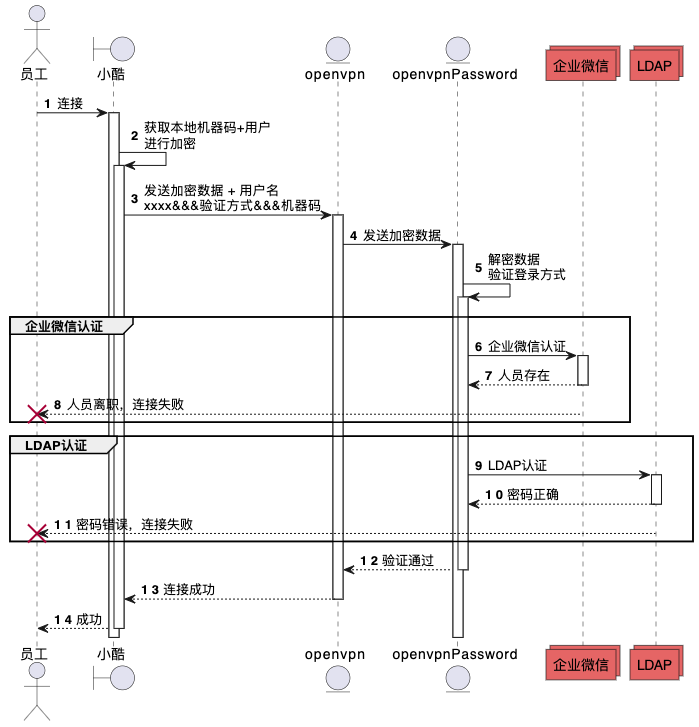

## 方案介绍
### 时序图

<!-- more -->
## 其中有两个地方需要修改
- `corpid`: 企业微信的企业ID
- `corpsecret`: 拥有通讯录的企业微信的Secret
## 代码如下
```go
package auth
import (
	"io/ioutil"
	"log"
	"net/http"
	"strconv"
	"github.com/tidwall/gjson"
)
func GetAccessToken() string {
	return GetWecomToken()
}
// 从企业微信获取Token
func GetWecomToken() string {
	//创建一个请求
	req, err := http.NewRequest("GET", "https://qyapi.weixin.qq.com/cgi-bin/gettoken?corpid=corpid&corpsecret=corpsecret", nil)
	if err != nil {
		log.Println("NewRquest:", err)
	}
	client := &http.Client{}
	//设置请求头
	req.Header.Set("Content-Type", "application/json; charset=utf-8")
	//发送请求
	resp, err := client.Do(req)
	//关闭请求
	defer resp.Body.Close()
	body, err := ioutil.ReadAll(resp.Body)
	access_token := gjson.Get(string(body), "access_token")
	return access_token.Str
}
// 获取员工信息
func WeComAuth(userId string) bool {
	//创建一个请求
	req, err := http.NewRequest("GET", `https://qyapi.weixin.qq.com/cgi-bin/user/get?access_token=`+GetAccessToken()+`&userid=`+userId, nil)
	if err != nil {
		log.Println("NewRquest:", err)
	}
	client := &http.Client{}
	//设置请求头
	req.Header.Set("Content-Type", "application/json; charset=utf-8")
	//发送请求
	resp, err := client.Do(req)
	//关闭请求
	defer resp.Body.Close()
	body, err := ioutil.ReadAll(resp.Body)
	errcode := gjson.Get(string(body), "errcode")
	int, err := strconv.Atoi(errcode.Str)
	return int == 0
}
```
## 使用方式
修改`/etc/openvpn/server.conf`的验证方式，可以吧其他的验证去掉
```shell
auth-user-pass-verify /etc/openvpn/openvpn-wecom-password via-file
```

## 加解密方式
因为用到了客户端传过来的时候的加密方式，因此两边的加密方式必须一致
```go
package util
import (
	"bytes"
	basicAES "crypto/aes"
	"crypto/cipher"
	"encoding/base64"
)
type Aes struct {
	securityKey []byte
	iv          []byte
}
/**
 * constructor
 */
func AesTool() *Aes {
	return &Aes{[]byte("123"), []byte("123")}
}
/**
 * 加密
 * @param string $plainText 明文
 * @return bool|string
 */
func (a Aes) Encrypt(plainText string) (string, error) {
	block, err := basicAES.NewCipher(a.securityKey)
	if err != nil {
		return "", err
	}
	plainTextByte := []byte(plainText)
	blockSize := block.BlockSize()
	plainTextByte = AddPKCS7Padding(plainTextByte, blockSize)
	cipherText := make([]byte, len(plainTextByte))
	mode := cipher.NewCBCEncrypter(block, a.iv)
	mode.CryptBlocks(cipherText, plainTextByte)
	return base64.StdEncoding.EncodeToString(cipherText), nil
}
/**
 * 解密
 * @param string $cipherText 密文
 * @return bool|string
 */
func (a Aes) Decrypt(cipherText string) (string, error) {
	block, err := basicAES.NewCipher(a.securityKey)
	if err != nil {
		return "", err
	}
	cipherDecodeText, decodeErr := base64.StdEncoding.DecodeString(cipherText)
	if decodeErr != nil {
		return "", decodeErr
	}
	mode := cipher.NewCBCDecrypter(block, a.iv)
	originCipherText := make([]byte, len(cipherDecodeText))
	mode.CryptBlocks(originCipherText, cipherDecodeText)
	originCipherText = StripPKSC7Padding(originCipherText)
	return string(originCipherText), nil
}
/**
 * 填充算法
 * @param string $source
 * @return string
 */
func AddPKCS7Padding(ciphertext []byte, blockSize int) []byte {
	padding := blockSize - len(ciphertext)%blockSize
	paddingText := bytes.Repeat([]byte{byte(padding)}, padding)
	return append(ciphertext, paddingText...)
}
/**
 * 移去填充算法
 * @param string $source
 * @return string
 */
func StripPKSC7Padding(cipherText []byte) []byte {
	length := len(cipherText)
	unpadding := int(cipherText[length-1])
	return cipherText[:(length - unpadding)]
}
```